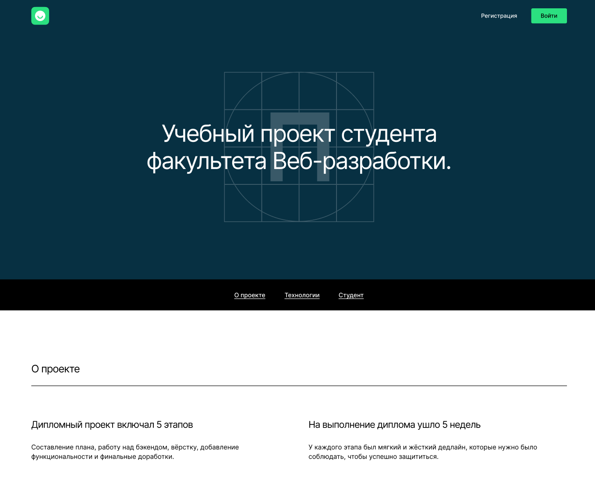

# movies-explorer-frontend

Репозиторий для  фронтенд части дипломного проекта `MoviesExplorer`.

## Ссылка на макет проекта

https://disk.yandex.ru/d/9CpJsjaYpptlzA

## В проекте использовались:

- HTML
- CSS
- JS
- React

## Директории проекта

- `src/components` — директория с файлами компонентов
  - `/contexts` - дириктория с контекстом пользователя
- `src/images` — директория с файлами изображений
- `src/utils` — директория с файлами констант, хуков, запросов к API
- `src/vendor` — директория с файлами сторонних библиотек
  - `/fonts` — директория со шрифтами

### Запуск проекта

- `npm start` — запуск проекта в режиме разработки
- `npm run build` — сборка файлоя для деплоя в папке`/build`

Адрес репозитория: https://github.com/h1ze/movies-explorer-frontend
